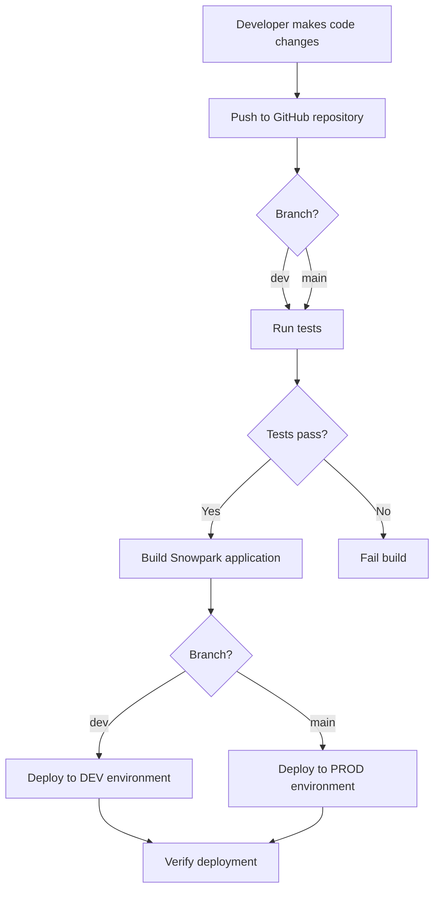
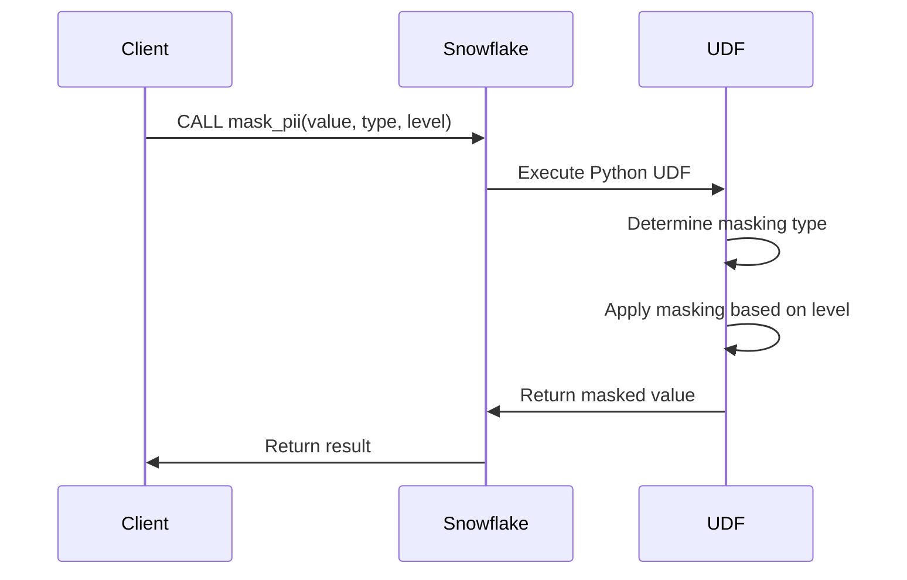
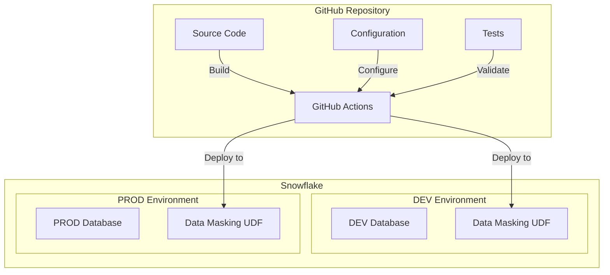
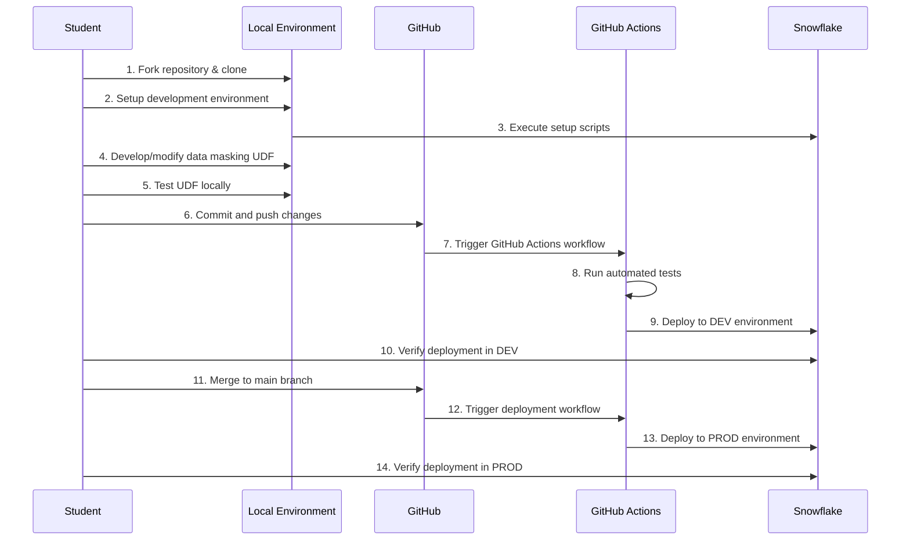

# Data Masking UDF - CI/CD with Snowflake Lab Plan

## Overview

This document outlines the implementation plan for a hands-on lab on CI/CD with Snowflake, focused on creating and deploying a data masking User-Defined Function (UDF). The lab will guide students through the process of building, testing, and automatically deploying a Python UDF to Snowflake using GitHub Actions.

## Learning Objectives

By the end of this lab, students will be able to:

1. Create a Snowpark Python UDF for data masking
2. Configure Snowflake environments using YAML
3. Build a GitHub Actions workflow for CI/CD
4. Deploy Snowpark applications using the Snowflake CLI
5. Test and verify deployments across environments

## Project Structure

```
snowflake-cicd-lab/
├── .github/
│   └── workflows/
│       └── snowpark-ci-cd.yml     # GitHub Actions workflow
├── config/
│   ├── dev.yml                    # Development environment config
│   └── prod.yml                   # Production environment config
├── src/
│   └── data_masker/               # Snowpark UDF project
│       ├── requirements.txt       # Dependencies
│       ├── snowflake.yml          # Snowflake project definition
│       └── data_masker/
│           ├── __init__.py
│           └── function.py        # UDF implementation
├── scripts/
│   ├── setup_snowflake.sql        # Initial setup script
│   └── load_sample_data.sql       # Load sample data with PII
├── tests/
│   └── test_data_masker.py        # UDF tests
└── README.md                      # Lab instructions
```

## Lab Implementation Details

### 1. Data Masking UDF Functionality

The UDF will be able to mask different types of Personally Identifiable Information (PII):

- **Email addresses**: `mask_email('john.doe@example.com')` → `'j***@e***.com'`
- **Phone numbers**: `mask_phone('123-456-7890')` → `'XXX-XXX-7890'`
- **Credit card numbers**: `mask_credit_card('4111-1111-1111-1111')` → `'XXXX-XXXX-XXXX-1111'`
- **Social Security Numbers**: `mask_ssn('123-45-6789')` → `'XXX-XX-6789'`

The UDF will have a configurable masking level (high, medium, low) to demonstrate parameter handling.

## Flow Diagrams

### CI/CD Workflow



### UDF Execution Flow



### Project Structure Diagram



## Implementation Steps

### Step 1: Snowflake Environment Setup

1. Create databases for development and production
2. Create schemas, warehouses, and stages
3. Set up appropriate roles and permissions
4. Configure external stages for code deployment

```sql
-- Example setup script
CREATE OR REPLACE DATABASE CICD_LAB_DEV;
CREATE OR REPLACE DATABASE CICD_LAB_PROD;

-- Create schemas
CREATE OR REPLACE SCHEMA CICD_LAB_DEV.DATA_SECURITY;
CREATE OR REPLACE SCHEMA CICD_LAB_PROD.DATA_SECURITY;

-- Create warehouses
CREATE OR REPLACE WAREHOUSE CICD_LAB_WH 
    WAREHOUSE_SIZE = XSMALL 
    AUTO_SUSPEND = 300 
    AUTO_RESUME = TRUE;

-- Create stages for code deployment
CREATE OR REPLACE STAGE CICD_LAB_DEV.DATA_SECURITY.DEPLOYMENT;
CREATE OR REPLACE STAGE CICD_LAB_PROD.DATA_SECURITY.DEPLOYMENT;

-- Create role for CI/CD
CREATE OR REPLACE ROLE CICD_ROLE;
GRANT USAGE ON DATABASE CICD_LAB_DEV TO ROLE CICD_ROLE;
GRANT USAGE ON DATABASE CICD_LAB_PROD TO ROLE CICD_ROLE;
GRANT USAGE ON SCHEMA CICD_LAB_DEV.DATA_SECURITY TO ROLE CICD_ROLE;
GRANT USAGE ON SCHEMA CICD_LAB_PROD.DATA_SECURITY TO ROLE CICD_ROLE;
GRANT USAGE ON WAREHOUSE CICD_LAB_WH TO ROLE CICD_ROLE;
```

### Step 2: Sample Data Creation

Create a table with PII data for testing:

```sql
-- Sample data script
CREATE OR REPLACE TABLE CICD_LAB_DEV.DATA_SECURITY.CUSTOMER_DATA (
    CUSTOMER_ID INT,
    NAME VARCHAR(100),
    EMAIL VARCHAR(100),
    PHONE VARCHAR(20),
    CREDIT_CARD VARCHAR(19),
    SSN VARCHAR(11)
);

-- Insert dummy data
INSERT INTO CICD_LAB_DEV.DATA_SECURITY.CUSTOMER_DATA VALUES
(1, 'John Doe', 'john.doe@example.com', '123-456-7890', '4111-1111-1111-1111', '123-45-6789'),
(2, 'Jane Smith', 'jane.smith@company.org', '456-789-0123', '5555-5555-5555-4444', '456-78-9012'),
(3, 'Bob Johnson', 'bob.johnson@mail.net', '789-012-3456', '3782-8224-6310-005', '789-01-2345');

-- Copy to production for consistency
CREATE OR REPLACE TABLE CICD_LAB_PROD.DATA_SECURITY.CUSTOMER_DATA 
AS SELECT * FROM CICD_LAB_DEV.DATA_SECURITY.CUSTOMER_DATA;
```

### Step 3: Data Masker UDF Implementation

The core UDF implementation:

```python
# data_masker/function.py
import re

def mask_email(email, level='medium'):
    """Mask an email address based on the specified level"""
    if not email or '@' not in email:
        return email
        
    username, domain = email.split('@')
    domain_parts = domain.split('.')
    
    if level == 'high':
        # High masking: completely hide username and domain
        masked_username = '*' * len(username)
        masked_domain = '*' * len(domain_parts[0]) + '.' + domain_parts[1]
    elif level == 'medium':
        # Medium masking: show first character of username and domain
        masked_username = username[0] + '*' * (len(username) - 1)
        masked_domain = domain_parts[0][0] + '*' * (len(domain_parts[0]) - 1) + '.' + domain_parts[1]
    else:  # low
        # Low masking: show first and last character
        if len(username) > 2:
            masked_username = username[0] + '*' * (len(username) - 2) + username[-1]
        else:
            masked_username = username[0] + '*' * (len(username) - 1)
        masked_domain = domain
        
    return f"{masked_username}@{masked_domain}"

def mask_phone(phone, level='medium'):
    """Mask a phone number based on the specified level"""
    if not phone:
        return phone
        
    # Remove non-digit characters for processing
    digits = re.sub(r'\D', '', phone)
    
    if level == 'high':
        # High masking: show only last 2 digits
        masked = 'X' * (len(digits) - 2) + digits[-2:]
    elif level == 'medium':
        # Medium masking: show only last 4 digits
        masked = 'X' * (len(digits) - 4) + digits[-4:]
    else:  # low
        # Low masking: show last 7 digits (hide area code)
        masked = 'X' * (len(digits) - 7) + digits[-7:]
    
    # Reapply formatting if original had formatting
    if '-' in phone:
        if len(digits) == 10:  # US format
            return f"{'X' * 3}-{'X' * 3}-{digits[-4:]}"
        else:
            # Best effort to maintain original format
            return re.sub(r'\d', 'X', phone[:-4]) + phone[-4:]
    
    return masked

def mask_credit_card(cc_number, level='medium'):
    """Mask a credit card number based on the specified level"""
    if not cc_number:
        return cc_number
        
    # Remove non-digit characters for processing
    digits = re.sub(r'\D', '', cc_number)
    
    if level == 'high':
        # High masking: show only last 4 digits
        masked = 'X' * (len(digits) - 4) + digits[-4:]
    elif level == 'medium':
        # Medium masking: show first digit and last 4 digits
        masked = digits[0] + 'X' * (len(digits) - 5) + digits[-4:]
    else:  # low
        # Low masking: show first and last 4 digits, mask middle
        masked = digits[:4] + 'X' * (len(digits) - 8) + digits[-4:]
    
    # Reapply formatting if original had formatting
    if '-' in cc_number:
        formatted = ''
        i = 0
        for char in cc_number:
            if char == '-':
                formatted += '-'
            else:
                if i < len(masked):
                    formatted += masked[i]
                    i += 1
                else:
                    formatted += 'X'
        return formatted
    
    return masked

def mask_ssn(ssn, level='medium'):
    """Mask a Social Security Number based on the specified level"""
    if not ssn:
        return ssn
        
    # Remove non-digit characters for processing
    digits = re.sub(r'\D', '', ssn)
    
    if level == 'high':
        # High masking: mask all digits
        masked = 'X' * len(digits)
    elif level == 'medium':
        # Medium masking: show only last 4 digits
        masked = 'X' * (len(digits) - 4) + digits[-4:]
    else:  # low
        # Low masking: show only last 4 digits
        masked = 'X' * (len(digits) - 4) + digits[-4:]
    
    # Reapply formatting if original had formatting
    if '-' in ssn and len(digits) == 9:
        return f"XXX-XX-{digits[-4:]}"
    
    return masked

def main(value, type='email', level='medium'):
    """
    Main entry point for the UDF
    
    Args:
        value (str): The value to mask
        type (str): Type of data - 'email', 'phone', 'credit_card', or 'ssn'
        level (str): Masking level - 'high', 'medium', or 'low'
    
    Returns:
        str: The masked value
    """
    if not value:
        return value
        
    if type.lower() == 'email':
        return mask_email(value, level)
    elif type.lower() == 'phone':
        return mask_phone(value, level)
    elif type.lower() == 'credit_card':
        return mask_credit_card(value, level)
    elif type.lower() == 'ssn':
        return mask_ssn(value, level)
    else:
        # Default behavior - return as is if type not recognized
        return value
```

### Step 4: Snowflake Project Definition

```yaml
# snowflake.yml
definition_version: 1
snowpark:
  project_name: "cicd_lab"
  stage_name: "data_security.deployment"
  src: "data_masker/"
  functions:
    - name: "mask_pii"
      database: "{DB_NAME}"  # Will be replaced during deployment
      schema: "data_security"
      handler: "function.main"
      runtime: "3.10"
      signature:
        - name: "value"
          type: "string"
        - name: "type"
          type: "string"
          default: "'email'"
        - name: "level"
          type: "string"
          default: "'medium'"
      returns: string
```

### Step 5: Environment Configuration

```yaml
# config/dev.yml
environment: "dev"
database_name: "CICD_LAB_DEV"
schema_name: "data_security"
stage_name: "deployment"
warehouse_name: "CICD_LAB_WH"

# config/prod.yml
environment: "prod"
database_name: "CICD_LAB_PROD"
schema_name: "data_security"
stage_name: "deployment"
warehouse_name: "CICD_LAB_WH"
```

### Step 6: GitHub Actions Workflow

```yaml
# .github/workflows/snowpark-ci-cd.yml
name: Snowpark CI/CD Pipeline

on:
  push:
    branches: [main, dev]
  pull_request:
    branches: [main]
  workflow_dispatch:

jobs:
  test:
    runs-on: ubuntu-latest
    steps:
      - uses: actions/checkout@v3
      - name: Set up Python
        uses: actions/setup-python@v4
        with:
          python-version: '3.10'
      - name: Install dependencies
        run: |
          python -m pip install --upgrade pip
          pip install pytest
          pip install -r src/data_masker/requirements.txt
      - name: Run tests
        run: pytest

  deploy:
    needs: test
    if: success() && (github.event_name != 'pull_request')
    runs-on: ubuntu-latest
    env:
      SNOWFLAKE_ACCOUNT: ${{ secrets.SNOWFLAKE_ACCOUNT }}
      SNOWFLAKE_USER: ${{ secrets.SNOWFLAKE_USER }}
      SNOWFLAKE_PASSWORD: ${{ secrets.SNOWFLAKE_PASSWORD }}
      SNOWFLAKE_ROLE: ${{ secrets.SNOWFLAKE_ROLE }}
    
    steps:
      - uses: actions/checkout@v3
      - name: Set up Python
        uses: actions/setup-python@v4
        with:
          python-version: '3.10'
      - name: Install dependencies
        run: |
          python -m pip install --upgrade pip
          pip install snowflake-cli-labs
          pip install pyyaml
      - name: Set environment variables
        run: |
          if [[ "${{ github.ref }}" == "refs/heads/main" ]]; then
            echo "ENVIRONMENT=prod" >> $GITHUB_ENV
            echo "DB_NAME=CICD_LAB_PROD" >> $GITHUB_ENV
          else
            echo "ENVIRONMENT=dev" >> $GITHUB_ENV
            echo "DB_NAME=CICD_LAB_DEV" >> $GITHUB_ENV
          fi
      - name: Deploy Data Masking UDF
        run: |
          cd src/data_masker
          snow snowpark build --temporary-connection
          snow snowpark deploy --replace --temporary-connection
```

### Step 7: Deployment Script

```python
# deploy_snowpark_app.py
import sys
import os
import yaml
import subprocess

def deploy_snowpark_app(directory_path, env):
    """Deploy a Snowpark application to Snowflake"""
    print(f"Deploying Snowpark app in {directory_path} to {env} environment")
    
    # Read the project configuration
    with open(f"{directory_path}/snowflake.yml", "r") as file:
        config = yaml.safe_load(file)
    
    # Read environment-specific settings
    env_config_path = f"{os.path.dirname(os.path.dirname(directory_path))}/config/{env}.yml"
    with open(env_config_path, "r") as file:
        env_config = yaml.safe_load(file)
    
    # Create a modified config with environment values
    modified_config = config.copy()
    # Replace placeholders with environment values
    for function in modified_config.get('snowpark', {}).get('functions', []):
        function['database'] = env_config['database_name']
    
    # Write the modified config back to a temporary file
    temp_config_path = f"{directory_path}/snowflake_temp.yml"
    with open(temp_config_path, "w") as file:
        yaml.dump(modified_config, file)
    
    # Build and deploy using Snow CLI
    os.chdir(directory_path)
    
    # Set environment variables for snow CLI
    os.environ["SNOWFLAKE_WAREHOUSE"] = env_config["warehouse_name"]
    
    # Build the Snowpark app
    build_result = subprocess.run(["snow", "snowpark", "build"], capture_output=True, text=True)
    print(build_result.stdout)
    if build_result.returncode != 0:
        print(f"Error during build: {build_result.stderr}")
        return False
    
    # Deploy the Snowpark app
    deploy_result = subprocess.run(["snow", "snowpark", "deploy", "--replace"], 
                                  capture_output=True, text=True)
    print(deploy_result.stdout)
    if deploy_result.returncode != 0:
        print(f"Error during deployment: {deploy_result.stderr}")
        return False
    
    # Clean up
    os.remove(temp_config_path)
    return True

if __name__ == "__main__":
    # Get the environment from command line or default to dev
    env = sys.argv[1] if len(sys.argv) > 1 else "dev"
    root_dir = os.path.dirname(os.path.abspath(__file__))
    
    # Deploy the data masker app
    success = deploy_snowpark_app(f"{root_dir}/src/data_masker", env)
    if success:
        print("Deployment completed successfully")
    else:
        print("Deployment failed")
        sys.exit(1)
```

## Testing Strategy

### Unit Tests

```python
# tests/test_data_masker.py
import pytest
import sys
import os

# Add the src directory to the Python path
sys.path.append(os.path.join(os.path.dirname(__file__), '../src/data_masker/data_masker'))
from function import mask_email, mask_phone, mask_credit_card, mask_ssn, main

# Email tests
def test_mask_email_medium():
    assert mask_email('john.doe@example.com', 'medium') == 'j******@e******.com'

def test_mask_email_high():
    assert mask_email('john.doe@example.com', 'high') == '********@*******.com'

def test_mask_email_low():
    assert mask_email('john.doe@example.com', 'low') == 'j******e@example.com'

# Phone tests
def test_mask_phone_medium():
    assert mask_phone('123-456-7890', 'medium') == 'XXX-XXX-7890'

def test_mask_phone_high():
    assert mask_phone('123-456-7890', 'high') == 'XXX-XXX-XX90'

def test_mask_phone_low():
    assert mask_phone('123-456-7890', 'low') == 'XXX-456-7890'

# Credit card tests
def test_mask_credit_card_medium():
    assert mask_credit_card('4111-1111-1111-1111', 'medium') == '4XXX-XXXX-XXXX-1111'

def test_mask_credit_card_high():
    assert mask_credit_card('4111-1111-1111-1111', 'high') == 'XXXX-XXXX-XXXX-1111'

def test_mask_credit_card_low():
    assert mask_credit_card('4111-1111-1111-1111', 'low') == '4111-XXXX-XXXX-1111'

# SSN tests
def test_mask_ssn_medium():
    assert mask_ssn('123-45-6789', 'medium') == 'XXX-XX-6789'

def test_mask_ssn_high():
    assert mask_ssn('123-45-6789', 'high') == 'XXX-XX-XXXX'

def test_mask_ssn_low():
    assert mask_ssn('123-45-6789', 'low') == 'XXX-XX-6789'

# Main function tests
def test_main_default():
    assert main('john.doe@example.com') == 'j******@e******.com'

def test_main_phone():
    assert main('123-456-7890', 'phone') == 'XXX-XXX-7890'

def test_main_credit_card():
    assert main('4111-1111-1111-1111', 'credit_card') == '4XXX-XXXX-XXXX-1111'

def test_main_ssn():
    assert main('123-45-6789', 'ssn') == 'XXX-XX-6789'

def test_main_high_level():
    assert main('john.doe@example.com', 'email', 'high') == '********@*******.com'
```

### Functional Tests in Snowflake

```sql
-- To be run after deployment
SELECT mask_pii('john.doe@example.com', 'email', 'medium');
SELECT mask_pii('123-456-7890', 'phone', 'medium');
SELECT mask_pii('4111-1111-1111-1111', 'credit_card', 'medium');
SELECT mask_pii('123-45-6789', 'ssn', 'medium');

-- Test with real data
SELECT 
    CUSTOMER_ID,
    NAME,
    mask_pii(EMAIL, 'email', 'medium') AS MASKED_EMAIL,
    mask_pii(PHONE, 'phone', 'medium') AS MASKED_PHONE,
    mask_pii(CREDIT_CARD, 'credit_card', 'medium') AS MASKED_CC,
    mask_pii(SSN, 'ssn', 'medium') AS MASKED_SSN
FROM CICD_LAB_DEV.DATA_SECURITY.CUSTOMER_DATA;
```

## Lab Execution Flow



## Lab Schedule Timeline

| Time | Activity |
|------|----------|
| 00:00 - 00:05 | Introduction and Overview |
| 00:05 - 00:15 | Setup GitHub Repository and Codespace |
| 00:15 - 00:25 | Setup Snowflake Environment |
| 00:25 - 00:40 | Understand Data Masking UDF Structure |
| 00:40 - 00:55 | Build and Test UDF Locally |
| 00:55 - 01:10 | Manual Deployment with SnowCLI |
| 01:10 - 01:25 | GitHub Actions CI/CD Setup |
| 01:25 - 01:40 | Automated Deployment to DEV and PROD |
| 01:40 - 01:55 | Testing and Verification |
| 01:55 - 02:00 | Wrap-up and Q&A |

## Extensions and Additional Challenges

1. **Add Additional Masking Types**:
   - Add support for masking addresses
   - Add support for masking names
   - Add support for custom patterns (using regex)

2. **Implement Advanced Security**:
   - Add encryption/decryption capabilities
   - Implement role-based access to the UDF

3. **Monitoring and Logging**:
   - Add deployment notifications (Slack, Email)
   - Add usage tracking for the UDF

4. **Multi-Environment Pipeline**:
   - Add a staging environment between dev and prod
   - Implement approval gates for production deployment

## Conclusion

This lab provides a practical, real-world example of implementing CI/CD for Snowflake applications using GitHub Actions. By creating a data masking UDF, students will gain hands-on experience with a useful security function while learning critical DevOps principles that can be applied to larger and more complex projects.
